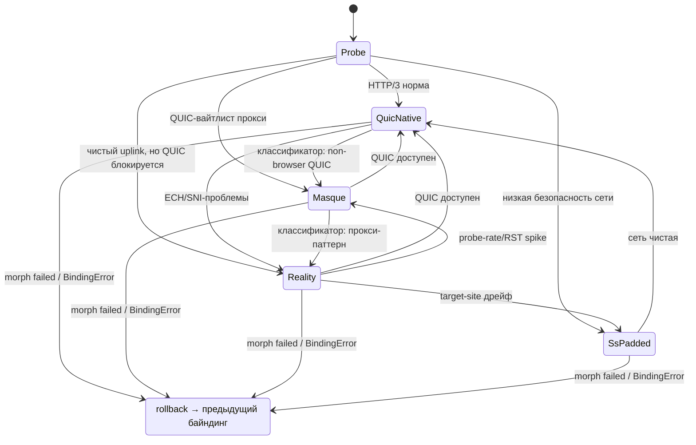

# Aether — протоколы и механизмы (v3, drilldown ротации и handshake)

Главные изменения v2: (1) добавлен frame-слой как носитель сессии; (2) ротация описана
до уровня сообщений (ticket-based, make-before-break); (3) 0-RTT переосмыслен; (4) убраны
некорректные утверждения про «inner QUIC переживает всё» и «KEM едет в QUIC Initial».

**Изменения v3 (по результатам anti-air-audit и drilldown §3/§5):**
(1) handshake переименован: `Noise_IK`, а не XX — статический ключ узла предраспределён
в манифесте подписки (§5); (2) резюм требует proof-of-possession клиента: украденный ticket
больше не даёт сессии (§3.3); (3) post-rotation re-key переведён на свежий DH — прежняя формула
`HKDF(K_session, "rotate", eph)` forward secrecy против N1 не давала (§3.3); (4) RESUME получил
явную защиту `K_resume`, снято противоречие per-node/fleet wrap: wrap объявлен флотским (§3.2);
(5) дедуп на узле специфицирован окном 4096 и клейм заменён на at-most-once (§3.5);
(6) крана объявлен как разрешаемая клиентом + consumed-set на узле (§3.6); (7) multi-hop
объявлен RESEARCH-GRADE без ложного «спроектирован» (§3.4).

## 1. FrameSession — cover-agnostic record-протокол (носитель сессии)

Сессия Aether — это НЕ транспортное соединение. Это таблица потоков + ключи + счётчики,
живущие на клиенте (SessionStore) и восстановимые на узле из ticket. Все данные ходят records:

```
Record = type(1B) | stream_id(varint) | flags(1B) | len(varint) | ciphertext
ciphertext = XChaCha20-Poly1305(K_record, nonce = seq(8B) || sid(16B), plaintext)
```

- `K_record` — производная от `K_session` через ratchet: `K_record[n] = HKDF(K_record[n-1])`
  (per-record forward secrecy, периодический re-key).
- `seq` — монотонный счётчик записей сессии (не потока); узел подтверждает continuity point
  по `seq` и дедуплицирует по `(sid, seq)` — идемпотентный дедуп, **at-most-once на выходе**
  (exactly-once не заявляется; окно и его границы — `§3.5`).
- Типы: DATA, ACK, RESUME, RESUME_ACK, REKEY, KEEPALIVE, COVER_HINT, CLOSE.
- `stream_id` ↔ один прикладной поток (route rule / app flow). FIN-семантика через flags.

**Инвариант:** сессия живёт, пока жив `(K_session, stream_table, seq)`. Транспортные
соединения (outer) приходят и уходят — обложки, узлы, even протоколы (UDP/TCP).

## 2. Байндинги frame-слоя к транспортам

### 2.1 QUIC-нативный байндинг (дефолт)
- Один outer QUIC connection; `stream_id` ↔ QUIC stream → no-HOL, migration, CID rotation.
- Control-записи (RESUME/REKEY) — отдельный QUIC stream.
- 0-RTT early data outer QUIC — только для control-записей без побочных эффектов (KEEPALIVE),
  и только если стек поддерживает; иначе 1-RTT resumption через TLS tickets.
- **Следствие v3:** `RESUME` идемпотентным больше не является — повтор того же ticket даёт
  `RESUME_NAK replay` (`§3.6`). Поэтому по умолчанию RESUME идёт после подтверждённого outer–хендшейка,
  а его отправка в 0-RTT допустима только вместе с обработкой NAK/ретрая.

### 2.2 Reality/TCP-байндинг (tradeoff — задокументирован)
- Records идут как length-prefixed frames поверх сплайснутого TLS-потока Reality.
- **HOL-блокировка на TCP существует для этого байндинга** — это цена самой сильной статики
  против DPI. Митигация: MorphController использует Reality только при явной блокировке
  QUIC-путей, и переключается на QUIC-байндинг при первой возможности (FSM `§4`).
- QUIC-over-TCP не используется (противоестественно: datagram-протокол в stream).

### 2.3 MASQUE-байндинг (RFC 9298 CONNECT-UDP)
- Records — полезная нагрузка UDP-капсул в CONNECT-UDP сессии поверх HTTP/3.
- Выглядит как легитимный HTTP/3 прокси-трафик; проходит QUIC-вайтлистящие цензоры.

## 3. Ротация egress-узла (Stateless Egress Core)

Паттерн: **TLS session tickets (RFC 8446 §2.2), адаптированный под флот узлов**, плюс
proof-of-possession клиента и свежий DH на ротации.

### 3.1 Ключи и единый канал раздачи

| Ключ | Размер | У кого priv | Назначение |
|---|---|---|---|
| `authority_sign` Ed25519 | 32 B | authority | подпись манифеста подписки |
| `TFK_epoch` (AEAD) | 32 B | **только узлы флота** | wrap/unwrap ticket |
| `node_static` X25519 | 32 B | узел | DH-половина Noise_IK |
| `node_identity` Ed25519 | 32 B | узел | подпись `RESUME_ACK` |
| `client_static` X25519 | 32 B | клиент | DH-половина Noise_IK |
| `client_identity` Ed25519 | 32 B | клиент | PoP-подпись `RESUME` |
| `K_session` | 32 B | клиент + текущий узел | мастер сессии |
| `K_resume` | 32 B | любой узел флота (из ticket) | защита RESUME/RESUME_ACK |
| `K_record` | 32 B | клиент + узел | записи (ratchet) |

Канал раздачи — **манифест подписки**, подписанный `authority_sign`, доставляется по тому же
subscription-update каналу, но payload **ролевой**:

| Получатель | Что получает |
|---|---|
| Узел флота | `TFK_epoch`, `epoch_id`, `node_set_id`, авторизованный набор `client_static`/`client_identity` pub |
| Клиент | `node_static`/`node_identity` pub узлов флота, свои ключи, `node_set_id` |

**`TFK_epoch` клиенту не выдаётся никогда** — иначе клиент минтит tickets сам, и PoP с containment
обходятся. Аутентификация канала: подпись authority, монотонная версия манифеста, `manifest_exp`;
доставка по mTLS. Отзыв узла или клиента = исключение из списка. При недоступности authority
работа продолжается на текущем манифесте до `manifest_exp`, новые ключи не принимаются.

### 3.2 Ticket

`ticket_blob = nonce(12 B) ‖ AEAD_XChaCha20Poly1305(TFK_epoch, nonce, plaintext)`

| Поле plaintext | Размер | Кто выставляет |
|---|---|---|
| `version` | 1 B | узел-минтер |
| `session_id` | 16 B | узел-минтер |
| `node_set_id` | 4 B | authority (из манифеста) |
| `epoch_id` | 4 B | узел-минтер |
| `minted_at` | 8 B | узел-минтер |
| `exp` | 8 B | узел-минтер |
| `K_session_wrapped` | 32 B | узел-минтер |
| `client_auth_pub` (Ed25519) | 32 B | узел-минтер (из авторизованного набора) |
| `window_lo`, `window_hi` | 8 B + 8 B | узел-минтер (пол дедупа на момент минта) |

Итого blob ≈ 165 B. **Wrap — флотский** (`TFK_epoch` у всех узлов флота): компрометация одного
узла вскрывает tickets эпохи. Это задокументированный tradeoff; per-node wrap — hardening вне MVP.

Mint делает **только узел**, по запросу клиента (MINT_REQ внутрь `K_session`) или сразу после
handshake. Клиентский `KeyCoordinator` не минтит и `TFK_epoch` не имеет: он хранит ticket,
запрашивает mint, делает PoP-подпись и проводит re-key (см. `03-components`, `01-architecture`).

### 3.3 Ротация: PoP + свежий DH (1 RTT)

`K_resume = HKDF-Expand(HKDF-Extract(salt = session_id, ikm = K_session), "aether v3 resume", 32)`

**RESUME** (клиент → N2, в control-стриме поверх шифрованного outer):

| Поле | Размер | Кто выставляет |
|---|---|---|
| `ticket_blob` | ~165 B | узел-минтер (непрозрачен, вне `K_resume`) |
| `sealed{K_resume}` → `last_seq` | 8 B | клиент |
| `sealed{K_resume}` → `window_lo`, `window_hi` | 8 B + 8 B | клиент |
| `sealed{K_resume}` → `eph_client` X25519 pub | 32 B | клиент |
| `sealed{K_resume}` → `client_nonce` | 16 B | клиент |
| `sealed{K_resume}` → `sig_client` Ed25519 | 64 B | клиент |

`sig_client` покрывает `"aether-resume-v3" ‖ sha256(ticket_blob) ‖ last_seq ‖ window_lo ‖ window_hi
‖ eph_client ‖ client_nonce`. N2 разворачивает `ticket_blob` флотским `TFK_epoch` → получает
`K_session` → вычисляет `K_resume` → рассекречивает остаток. **Узел проверяет `sig_client` по
`client_auth_pub` из ticket: украденный `ticket_blob` резюм не даёт.** Тикет летит вне `K_resume`,
но внутри шифрованного outer, то есть защищён от сети и открыт для флота — как и требуется.

**RESUME_ACK** (N2 → клиент, sealed под `K_resume`):

| Поле | Размер | Кто выставляет |
|---|---|---|
| `continuity_point` | 8 B | N2 |
| `window_lo`, `window_hi` | 8 B + 8 B | N2 |
| `eph_node` X25519 pub | 32 B | N2 |
| `sig_node` Ed25519 | 64 B | N2 |

`sig_node` покрывает `"aether-resume-ack-v3" ‖ sha256(transcript_client) ‖ continuity_point ‖
window_lo ‖ window_hi ‖ eph_node`. **Подпись узла обязательна:** без неё скомпрометированный N1,
знающий `K_session`, подсунул бы свой `eph_node` и сохранил чтение — фикс свежего DH без неё не работает.

**Post-rotation re-key:**

`ss_rotate = DH(eph_client_priv, eph_node_pub)` — 32 B
`K_session' = HKDF-Expand(HKDF-Extract(salt = session_id, ikm = ss_rotate ‖ K_session), "aether v3 rotate", 32)`

ratchet `K_record` перезапускается от `K_session'`. N1, знающий только `K_session`, `ss_rotate`
не вычислит, а подделать `RESUME_ACK` без `node_identity` не может → пост-ротационный трафик
ему недоступен.

Шаг 5 прежней редакции (дублирование `seq >= continuity_point` на оба канала до подтверждения,
затем teardown старого) сохраняется; таймаут и бюджет дублирования — `§4`.

**Состояния по сторонам** (клиент / N1 старый / N2 новый):

| Сторона | До ротации | Во время (make-before-break) | После |
|---|---|---|---|
| Клиент | `K_session`, `K_record`, seq, ticket | + `eph_client`, `client_nonce`, дубли на оба канала | `K_session'`, ratchet от нуля, `window_lo/hi` |
| N1 (старый узел) | `K_session`, окно 4096, consumed-set эпохи | принимает дубли, гасится по сигналу клиента | состояния сессии нет; `K_session` пост-ротационный трафик не читает |
| N2 (новый узел) | только `TFK_epoch` + манифест | unwrap ticket, проверка PoP, отправка ACK | `K_session'`, своё окно 4096, consumed-set пополнен |

### 3.4 Multi-hop (Federated Egress Mesh) — RESEARCH-GRADE

RESEARCH-GRADE (Phase 3): per-hop фрейминг и ключи хопов не специфицированы; см. `05-roadmap`.

Цепочка 1–3 узлов, per-hop гибрид, `K_session` end-to-end между клиентом и последним хопом.
**Механизм прохождения кадра через хопы (вложенная ре-инкапсуляция? ключи хопов? onion-слои?)
не специфицирован.** Каркас: SessionStore держит chain descriptor, адресация следующего хопа
в control-записи. Валидация метрики — Phase 3.

### 3.5 Дедуп на узле

Клейм: **идемпотентный дедуп по `(sid, seq)`, at-most-once на выходе**. Exactly-once не заявляется.

| Параметр | Значение | Владелец |
|---|---|---|
| Окно | 4096 записей (bitmap 512 B per session) | узел, in-memory |
| `window_lo` при resume | max(пол из ticket, `last_seq` − 4096) | узел |
| `seq < window_lo` | drop + счётчик аномалии | узел |
| `seq` в окне повторно | drop, `continuity_point` не двигается | узел |
| Потеря состояния (рестарт) | окно восстанавливается из подписанного клиентом `last_seq` | узел |

Узел держит окно только на время сессии; состояния, переживающего ротацию, у него нет.
`last_seq`/`window_lo/hi` приходят от клиента и покрыты его подписью (`§3.3`) — иначе клиент мог бы
произвольно двигать пол. Клиент-обманщик вредит только собственной целостности, что допустимо.

### 3.6 Крана и повтор RESUME

- Узел держит **in-memory consumed-ticket set** на эпоху (ключ `epoch_id ‖ sha256(ticket_blob)`).
  Первый RESUME → `RESUME_ACK`; повтор того же ticket **на том же узле** → `RESUME_NAK replay`.
- **Набор теряется при рестарте узла** — принимаем и документируем: в окне до перезапуска повтор
  того же ticket даёт вторую живую сессию поверх PoP. Смягчение: короткие эпохи + `exp`.
- **Кране двух разных узлов** (N2 и N3) набором не решается — наборы не разделяются. Практически
  она достижима только для самого клиента (повтор при ретрае) или для узла флота, у которого
  уже есть `TFK_epoch` (вне модели угроз), потому что PoP-подпись третьей стороне недоступна.
  Разрешается на клиенте: побеждает первый валидный `RESUME_ACK`, второй канал уходит в quarantine
  (`§4`); при двух ACK одновременно — тот, чья `sig_node` проверена раньше.
- Ретрай после потери ACK: новый `client_nonce` и новый `eph_client`, тот же ticket (узел примет
  его один раз).

### 3.7 Ветки отказов

| Ветка | Детект | Действие |
|---|---|---|
| `RESUME_ACK` не пришёл | таймаут `T_ack` = 2 × SRTT, клип [200 ms, 2 s]; владелец FrameSession | ретрай с новым nonce (не более 2), затем откат на старый канал |
| `sig_client` неверна | узел | `RESUME_NAK bad_pop`, ticket не консумируется, инцидент в телеметрию узла |
| `sig_node` неверна | клиент | канал не подтверждён, узел в quarantine, откат на старый канал |
| Крана RESUME | узел и клиент | `§3.6` |
| Узел упал между RESUME и RESUME_ACK | клиент по `T_ack` | новый узел из `node_set_id`; старый канал живёт до валидного ACK |
| `epoch_id` не совпал | узел | `RESUME_NAK epoch`, фолбэк: полный IK-handshake `§5` |
| `exp` истёк | узел | `RESUME_NAK expired`, фолбэк: полный handshake |
| `last_seq` ниже пола из ticket | узел | принять окно от клиента, залогировать аномалию |

### 3.8 Инварианты

| Инвариант | Enforcement |
|---|---|
| Пост-ротационный трафик читает только новый узел | `K_session'` требует `ss_rotate`; `sig_node` не даёт подменить `eph_node` |
| Украденный ticket не даёт сессии | `sig_client` проверяется по `client_auth_pub` из ticket |
| Клиент не минтит tickets | `TFK_epoch` клиенту не выдаётся, mint только на узле |
| **Aether**-сессия не рвётся на ротации (payload-соединения — `05-roadmap` риск) | make-before-break: старый канал гасится только после валидного ACK |
| **At-most-once на узел; at-least-once при ротации** | окно 4096 у каждого узла, `window_lo` из ticket, при потере состояния — подписанный пол от клиента; дубли между узлами покрыты duplicate-окном (`§3.9`), глобального exactly-once нет и не заявляется |

### 3.9 Компромисс-анализ

| Скомпрометировано | Последствие | Митигация |
|---|---|---|
| `authority_sign` (корень доверия) | обнуляет отзыв `node_identity` / `client_identity` / `node_static` / `TFK_epoch`: подделанный манифест возвращает отозванные ключи в строй | короткий `manifest_exp` + ротация authority (вне MVP) |
| `TFK_epoch` | все tickets эпохи → `K_session` → чтение и resume | короткие эпохи, ротация TFK, per-node wrap вне MVP |
| `K_session` у N1 | трафик до ротации (по построению — узел и есть точка выхода) | post-rotation re-key |
| `client_identity` (Ed25519) | резюм с украденным ticket возможен | нужен ещё и ticket (SessionStore); отзыв клиента через манифест |
| `client_static` (X25519) | выдача себя за клиента в IK | отзыв через манифест; для резюма всё равно нужен `client_identity` |
| `node_identity` (Ed25519) | подмена `RESUME_ACK` → N1 сохраняет чтение | ротация ключа узла через манифест |
| `node_static` (X25519) | MITM на новом handshake ещё до IK-аутентификации | отзыв узла; на существующие сессии не влияет (FS через эфемерные ключи) |
| `K_record` в момент n | записи `> n` (ratchet однонаправленный) | периодический re-key + ротация узла |

Duplicate-окно при ротации ≈ 1 RTT дублированного трафика — bounded, задокументирован (`§4`).

## 4. Liquid Tunnel (морфинг FSM) — research-grade, но механизм описан



- Классификатор на устройстве (tiny ONNX/TFLite, класс 2506.11319): probe/block rate,
  RST/FIN паттерны, latency cliffs, распределение длин пакетов vs baseline (2509.23522).
- Метрика приёмки: false-negative < X% и false-positive < Y% на тестбеде Phase 2; пороги — Phase 2.
  Значения не выдумываются здесь: они зависят от распределения и стоимости ложных срабатываний на тестбеде.
- Морф = смена активного байндинга в TransportMux + (опц.) смена target-site/fingerprint.
- **Overlap-window при морфе (специфицировано v3):** дублирование records на старый+новый
  байндинги до ACK по новому; старый teardown. Параметры — в таблице ниже; бюджет именно
  двойной (`N` ИЛИ `T`), потому что одного счётчика записей мало (при низком трафике окно висит
  бесконечно), а одного таймера тоже (при высоком дубли раздуваются до его истечения).

| Параметр окна морфа | Значение | Владелец |
|---|---|---|
| Условие закрытия | валидный ACK по новому байндингу | FrameSession |
| Таймаут `T_morph` | 2 × SRTT, клип [200 ms, 2 s] | FrameSession (владелец таймера) |
| Бюджет дублирования | `N ≤ 4096` записей **или** `T_morph` — что раньше | FrameSession |
| Исчерпание бюджета | `MorphFailed` → ребро отката на предыдущий байндинг, обложка в quarantine | MorphController |
| Quarantine | обложка не выбирается `T_quar = 5 мин` (иначе FSM ретраит сломанную обложку) | MorphController |
| Синхронный отказ `send()` | `BindingError` → FSM, обложка в quarantine | TransportMux |
| Асинхронный отказ байндинга | событие `on_failure()` → тот же путь rollback/quarantine | TransportMux → FSM |
- Self-test: локальный прогон публичной DPI-модели (eval-only) для оценки обложек офлайн.

## 5. Гибридный PQ handshake (Noise_IK, стиль PQNoise)

**Исправление v3.** Прежняя формулировка «Noise-XX из двух сообщений» неверна дважды.
XX — это три сообщения, и он передаёт статический ключ **респондера**. У нас статический ключ
узла **предраспределён в манифесте подписки**, а по классификации Noise (`I` — статик инициатора
передаётся сразу; `K` — статик респондера известен заранее) это **IK**: два сообщения, один RTT.
Это же модель WireGuard. Если бы статик инициатора тоже был известен заранее, это был бы KK;
IK сохранён сознательно — узел узнаёт, кто звонит, только расшифровав msg1 своим статиком.

Свойства: клиент аутентифицирует узел по `node_static` из манифеста; узел аутентифицирует
клиента по своему авторизованному набору (`client_static`) — cryptokey routing.

Хендшейк едет **на control-стриме поверх уже установленного outer QUIC**, не в Initial
(датаграмма Initial ограничена ~1200 B).

**msg1** (клиент → узел):

| Поле | Размер | Кто выставляет |
|---|---|---|
| `e` X25519 eph pub | 32 B | клиент |
| `e_kem` ML-KEM-768 эфемерный encapsulation key | 1184 B | клиент |
| `sealed_s` статический X25519 клиента (encrypted) | 32 B + 16 B tag | клиент |

**msg2** (узел → клиент):

| Поле | Размер | Кто выставляет |
|---|---|---|
| `e` X25519 eph pub | 32 B | узел |
| `kem_ct` ML-KEM-768 ciphertext к `e_kem` | 1088 B | узел |
| `tag` пустая нагрузка | 16 B | узел |

Размеры — FIPS 203 Table 3 (pk 1184 B / ct 1088 B), итого ≈ 2.4 KB за 1 RTT.

**KEM остаётся эфемерным.** Если бы клиент инкапсулировал только к статическому PQ-ключу узла,
компрометация этой статики вскрыла бы записанные сессии и HNDL-клейм — центральный для проекта —
перестал бы держаться. Предраспределённые статики дают аутентификацию, эфемерный KEM даёт
post-quantum forward secrecy; это разные задачи.

`K_session = HKDF-Expand(HKDF-Extract(salt = sha256(transcript), ikm = ss_x25519(e,e) ‖ ss_x25519(e,s_node)
‖ ss_x25519(s_client,e) ‖ ss_x25519(s_client,s_node) ‖ ss_mlkem), "aether v3 session", 32)`

Безопасно, пока держит **либо** X25519, **либо** ML-KEM-768 → HNDL-safe для записей сессии.
Outer QUIC/TLS 1.3 — классический, его роль транспортная; PQ-защита относится к записям frame-слоя.

Крипто-агильность: KEM — именованный swappable параметр (2609.07849).

Реализация: **Clatter** — единственный готовый путь. Открытый вопрос для Phase 0.5: есть ли
`noise_hybrid_IK_*` в `handshakepattern` (модуль даёт готовые паттерны и утилиты для сборки своего);
если гибрида IK там нет — собрать его утилитами модуля. Требуется точная фиксация токенов
(`e` с DH- и KEM-половинами против отдельных `ekem`); размеры выше — бюджеты, порядок токенов
подтверждается библиотекой. Крейт без формального аудита, своё именование PQ-примитивов →
interop-тесты обязательны. `noise-protocol` + RustCrypto `ml-kem` — только через форк
(KEM-токенов нет); `snow` НЕ годится (только Kyber1024 r3).

**Плата за IK:** нет фолбэка на неизвестный статический ключ узла — ротация `node_static`
требует обновления манифеста до начала сессий. Это осознанный обмен на 1 RTT.

Подтвердить в Phase 0.5 (иначе паттерн пересматривается на KK): наличие гибридного IK в Clatter,
порядок токенов, транскрипт хендшейка, поведение при рассинхронизации манифеста.

## 6. App Mirage (research-grade)

CoverEngine синтезирует декой-потоки с byte-length/timing распределением популярного
приложения (FlowPaint-класс, 2606.22717), rate-limited, только по требованию классификатора.
Decoy — реальные зашифрованные байты к benign-назначению. Двухфазная валидация: офлайн
датасеты → живой DPI-тестбед (Phase 3).

## 7. Честная семантика 0-RTT

- Noise_IK не имеет 0-RTT resumption. Заявлять «0-RTT» для сессии — некорректно.
- Реальная семантика: **reconnect ≈ 1 RTT** = outer QUIC TLS resumption (где поддерживается
  стеком) + `RESUME` frame по ticket. 0-RTT early data outer QUIC — только идемпотентный
  контроль (и это надо верифицировать в стеке — см. roadmap Phase 0.5).

## 8. Сводка крипто

| Плоскость | Примитив | Статус |
|-----------|----------|--------|
| Handshake сессии | Noise_IK + `X25519MLKEM768` | реализуемо (Clatter); наличие гибрида IK — проверка Phase 0.5 |
| Записи сессии | `XChaCha20-Poly1305` + ratchet | реализуемо |
| Ротация | TLS-ticket + PoP + свежий DH re-key | спроектировано до полей (`§3`), тест в Phase 0 |
| Outer транспорт | стандартный QUIC/TLS 1.3 | классический (не PQ) — транспортная роль |
| Cover-синтез | FlowPaint-класс генератор | research-grade |
| Метаданные | CID rotation; ECH/OHTTP | ECH отложен (Phase 4) — сквозь quinn недоступен, серверная половина открыта |
