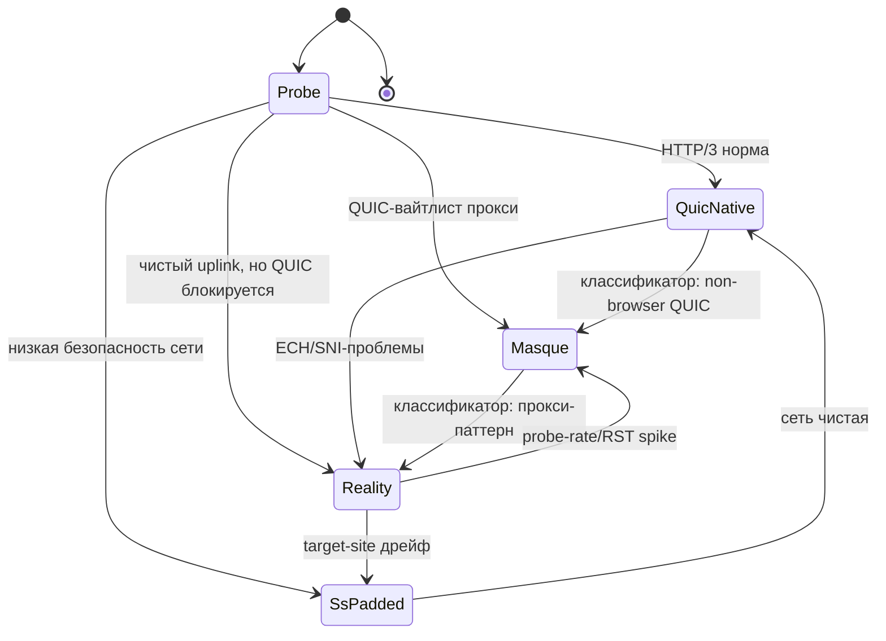

# Aether — протоколы и механизмы (v2, переработан)

Главные изменения v2: (1) добавлен frame-слой как носитель сессии; (2) ротация описана
до уровня сообщений (ticket-based, make-before-break); (3) 0-RTT переосмыслен; (4) убраны
некорректные утверждения про «inner QUIC переживает всё» и «KEM едет в QUIC Initial».

## 1. FrameSession — cover-agnostic record-протокол (носитель сессии)

Сессия Aether — это НЕ транспортное соединение. Это таблица потоков + ключи + счётчики,
живущие на клиенте (SessionStore) и восстановимые на узле из ticket. Все данные ходят records:

```
Record = type(1B) | stream_id(varint) | flags(1B) | len(varint) | ciphertext
ciphertext = XChaCha20-Poly1305(K_record, nonce = seq(8B) || sid(16B), plaintext)
```

- `K_record` — производная от `K_session` через ratchet: `K_record[n] = HKDF(K_record[n-1])`
  (per-record forward secrecy, периодический re-key).
- `seq` — монотонный счётчик записей; узел ACK-ает continuity point по seq (идемпотентно).
- Типы: DATA, ACK, RESUME, RESUME_ACK, REKEY, KEEPALIVE, COVER_HINT, CLOSE.
- `stream_id` ↔ один прикладной поток (route rule / app flow). FIN-семантика через flags.

**Инвариант:** сессия живёт, пока жив `(K_session, stream_table, seq)`. Транспортные
соединения (outer) приходят и уходят — обложки, узлы, even протоколы (UDP/TCP).

## 2. Байндинги frame-слоя к транспортам

### 2.1 QUIC-нативный байндинг (дефолт)
- Один outer QUIC connection; `stream_id` ↔ QUIC stream → no-HOL, migration, CID rotation.
- Control-записи (RESUME/REKEY) — отдельный QUIC stream.
- 0-RTT early data outer QUIC — **только для идемпотентных control-записей** (RESUME), и только
  если стек поддерживает; иначе 1-RTT resumption через TLS tickets.

### 2.2 Reality/TCP-байндинг (tradeoff — задокументирован)
- Records идут как length-prefixed frames поверх сплайснутого TLS-потока Reality.
- **HOL-блокировка на TCP существует для этого байндинга** — это цена самой сильной статики
  против DPI. Митигация: MorphController использует Reality только при явной блокировке
  QUIC-путей, и переключается на QUIC-байндинг при первой возможности (FSM `§4`).
- QUIC-over-TCP не используется (противоестественно: datagram-протокол в stream).

### 2.3 MASQUE-байндинг (RFC 9298 CONNECT-UDP)
- Records — полезная нагрузка UDP-капсул в CONNECT-UDP сессии поверх HTTP/3.
- Выглядит как легитимный HTTP/3 прокси-трафик; проходит QUIC-вайтлистящие цензоры.

## 3. Ротация egress-узла (Stateless Egress Core — теперь конкретно)

Паттерн: **TLS session tickets (RFC 8446 §2.2), адаптированный под флот узлов.**

### 3.1 Иерархия ключей
- `TFK_epoch` — fleet ticket key (32 B, симметричный), раздаётся всем узлам флота subscription
  authority через канал обновления подписки. Эпоха: часы–дни, короткая.
- `K_session` — мастер сессии, выводится из Noise-XX гибрида (только клиент + текущий узел).
- `K_record` — ratchet-цепочка производных для записей.

### 3.2 Ticket
```
ticket = AEAD_enc(TFK_epoch, { session_id, K_session_wrapped, exp, node_set_id })
K_session_wrapped = K_session, завернутый под ключ, известный только узлу-минтеру и клиенту
```
Минтит текущий узел по запросу клиента (или клиент заранее при handshake). Хранится
только у клиента (SessionStore). Сервер не хранит ничего.

### 3.3 Протокол ротации (make-before-break)
1. Клиент открывает outer QUIC к N2 (новая обложка допустима — байндинги независимы).
2. Отправляет `RESUME { ticket, last_seq, stream_table_digest }` на control-стрим.
3. N2 разворачивает ticket своим `TFK_epoch` → восстанавливает `K_session`, session-id.
   (Если эпоха не совпала — `RESUME_NAK`, фолбэк: полный re-handshake, старый канал жив.)
4. N2 шлёт `RESUME_ACK { continuity_point }`.
5. Клиент дублирует записи `seq >= continuity_point` на оба канала до подтверждения
   доставки по новому, затем teardown старого.
6. **Post-rotation re-key (forward secrecy):** `K_session' = HKDF(K_session, "rotate", eph_N2)`,
   ratchet перезапускается. Теперь скомпрометированный N1 не читает пост-ротационный трафик.

### 3.4 Multi-hop (Federated Egress Mesh)
Цепочка 1–3 узлов: каждый hop — свой Noise-XX гибрид; SessionStore держит chain descriptor.
Ротация одного hop — тем же ticket-механизмом, но `K_session` end-to-end между клиентом и
последним hop, промежуточные видят только следующий адрес (onion-стиль адресации в
control-записи). Валидация метрики — Phase 3.

### 3.5 Компромиссы (честно)
- Компрометация `TFK_epoch` вскрывает все tickets эпохи → короткие эпохи, per-fleet keys,
  опционально per-node wrapping c ре-энкапсуляцией через authority (tradeoff: сложность).
- Duplicate-окно при ротации ≈ 1 RTT дублированного трафика — bounded, задокументирован.

## 4. Liquid Tunnel (морфинг FSM) — research-grade, но механизм описан



- Классификатор на устройстве (tiny ONNX/TFLite, класс 2506.11319): probe/block rate,
  RST/FIN паттерны, latency cliffs, распределение длин пакетов vs baseline (2509.23522).
- Морф = смена активного байндинга в TransportMux + (опц.) смена target-site/fingerprint.
- **Overlap-window при морфе:** дублирование records на старый+новый байндинги до ACK
  по новому; старый teardown. Оверхед ограничен ~1 RTT окном.
- Self-test: локальный прогон публичной DPI-модели (eval-only) для оценки обложек офлайн.

## 5. Гибридный PQ handshake (Noise-XX, стиль NoisePQC++)

- Едет **на control-стриме поверх уже установленного outer QUIC**, а НЕ в QUIC Initial
  (Initial — стандартный TLS; влезание 1.2 KB KEM туда и не нужно, и не влезло бы: Initial
  датаграмма ограничена ~1200 B).
- Клиент → сервер: `eph X25519 (32 B) || ML-KEM-768 encapsulation key (1184 B)`.
- Сервер → клиент: `eph X25519 (32 B) || ML-KEM-768 ciphertext (1088 B)` (FIPS 203 размеры).
- `K_session = HKDF( X25519_ss || ML-KEM_ss )`. Безопасно, пока держит **либо** X25519,
  **либо** ML-KEM-768 → HNDL-safe для записей сессии.
- Крипто-агильность: KEM — именованный swappable параметр (2609.07849).
- Реализация: **Clatter** (Rust, PQNoise с ML-KEM-768) — единственный готовый путь.
  `noise-protocol` + RustCrypto `ml-kem` требует форка: KEM-токенов в абстрактной реализации
  нет, это не комбайн. Крейт `snow` НЕ годится (только Kyber1024 r3).

## 6. App Mirage (research-grade)

CoverEngine синтезирует декой-потоки с byte-length/timing распределением популярного
приложения (FlowPaint-класс, 2606.22717), rate-limited, только по требованию классификатора.
Decoy — реальные зашифрованные байты к benign-назначению. Двухфазная валидация: офлайн
датасеты → живой DPI-тестбед (Phase 3).

## 7. Честная семантика 0-RTT

- Noise-XX не имеет 0-RTT resumption. Заявлять «0-RTT» для сессии — некорректно.
- Реальная семантика: **reconnect ≈ 1 RTT** = outer QUIC TLS resumption (где поддерживается
  стеком) + `RESUME` frame по ticket. 0-RTT early data outer QUIC — только идемпотентный
  контроль (и это надо верифицировать в стеке — см. roadmap Phase 0.5).

## 8. Сводка крипто

| Плоскость | Примитив | Статус |
|-----------|----------|--------|
| Handshake сессии | Noise_XX + `X25519MLKEM768` | реализуемо (Clatter / ml-kem) |
| Записи сессии | `XChaCha20-Poly1305` + ratchet | реализуемо |
| Ротация | TLS-ticket паттерн + post-rotation re-key | спроектировано, тест в Phase 0 |
| Outer транспорт | стандартный QUIC/TLS 1.3 | классический (не PQ) — транспортная роль |
| Cover-синтез | FlowPaint-класс генератор | research-grade |
| Метаданные | CID rotation; ECH/OHTTP | ECH отложен (Phase 4) — сквозь quinn недоступен, серверная половина открыта |
